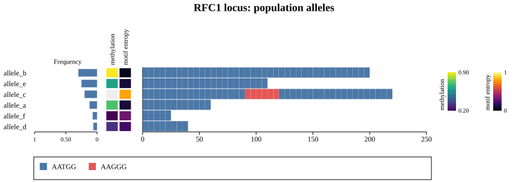
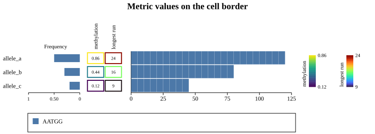
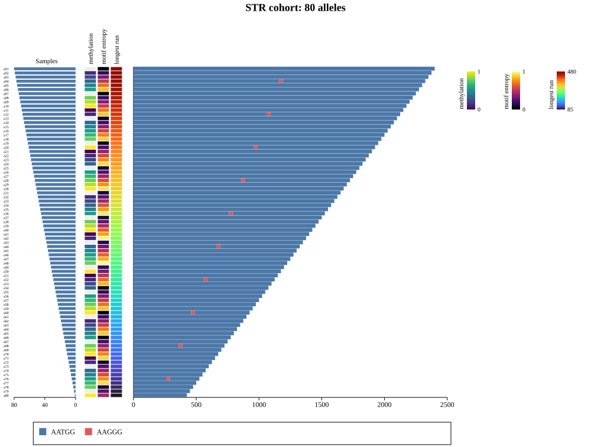

# Brick Pop Plot

A brick pop plot is a population view of a single short tandem repeat (STR) locus. It shows one row
per unique allele, sorted by frequency, and lines up three panels on the same rows:

* a horizontal **frequency bar** on the left (how common each allele is),
* a strip of **metric heatboxes** (per-allele values such as methylation, motif entropy, or longest
  pure run, each on its own colour scale),
* the **motif bricks** on the right (the allele's repeat structure, left anchored so expansions run
  off to the right).

`BrickPopPlot` is a composite figure, in the same family as [Coverage Plot](./coverage.md) and
[Figure](../reference/figure.md), not a bottom level plot type. It wraps a
[Brick Plot](./brick.md) for the brick column and draws the frequency bar, heatboxes, colourbars,
and a bottom motif legend around it. The panels stay aligned because the embedded brick's row band
is pinned to the same pixel span the side panels use, so every panel agrees on the row count and row
height.

**Type:** `kuva::render::brick_pop::BrickPopPlot`

---

## Basic usage

Build a [`BrickPlot`](./brick.md) with your alleles (STRIGAR motif data plus names), then wrap it in
`BrickPopPlot`, attach the per-row frequencies and metric columns, and render. Everything is
positional: the frequencies and each metric's values are indexed by row, in the same order as the
brick's rows. Call `.sorted_by_frequency()` to order every panel together so you do not have to sort
each vector by hand.

```rust,no_run
use kuva::plot::{BrickPlot, ColorMap};
use kuva::render::brick_pop::{BrickPopPlot, MetricColumn};
use kuva::backend::svg::SvgBackend;
use std::collections::HashMap;

// One colour per motif, keyed by canonical k-mer, so a motif keeps its colour everywhere.
let mut colours = HashMap::new();
colours.insert("AATGG".to_string(), "#4c78a8".to_string());
colours.insert("AAGGG".to_string(), "#e45756".to_string());

let brick = BrickPlot::new()
    .with_names(vec!["allele_a", "allele_b", "allele_c"])
    .with_motif_colors(colours)
    .with_strigars(vec![
        ("AATGG:A".to_string(), "12A".to_string()),
        ("AATGG:A".to_string(), "40A".to_string()),
        ("AATGG:A,AAGGG:B".to_string(), "18A6B20A".to_string()),
    ]);

let scene = BrickPopPlot::new(brick)
    .with_title("RFC1 locus: population alleles")
    .with_frequencies(vec![0.30, 0.45, 0.25])
    .with_metric("methylation", vec![Some(0.7), Some(0.9), None], ColorMap::Viridis)
    .with_metric_column(
        MetricColumn::new("motif entropy", vec![Some(0.1), Some(0.05), Some(0.8)], ColorMap::Inferno)
            .with_range(0.0, 1.0),
    )
    .sorted_by_frequency()
    .render(880.0);

let svg = SvgBackend::new().render_scene(&scene);
std::fs::write("brick_pop.svg", svg).unwrap();
```



Alleles are drawn top to bottom in the order you supply, so sort by frequency first (or call
`.sorted_by_frequency()`, which permutes the rows, the frequencies, and every metric together).

---

## The frequency scale

The frequency bar auto-scales to `[0, 1]` when the values look like proportions (all in that range),
and to `[0, max]` otherwise. This matters for small cohorts: twelve singleton haplotypes at 0.083
each render as short, equal bars rather than every bar filling to the maximum, so a polymorphic
locus and a single-dominant-allele locus look obviously different and bars stay comparable across
loci. Pin the scale explicitly with `.with_frequency_range(vmin, vmax)` when you want a fixed axis
(for example counts on a shared `[0, N]` range).

---

## Metrics and colourbars

Each `MetricColumn` is one strip of heatboxes coloured by a [`ColorMap`](../reference/colormap.md).
The value range is taken from the finite values unless you pin it with `.with_range(vmin, vmax)`, and
missing values (`None`) render in the NA colour. The colourbars are drawn side by side on the right,
each with its title running vertically on its left, and the motif legend sits along the bottom (as a
[Legend Plot](./legend.md) grid) so it can wrap to as many rows as a complex locus needs.

### Values in the box

For a small number of alleles with tall rows, `.with_metric_values(true)` writes the number inside
each cell and moves the heat colour to the cell border, which is easier to read exactly. Cells that
are too small fall back to a solid fill automatically.

```rust,no_run
# use kuva::plot::{BrickPlot, ColorMap};
# use kuva::render::brick_pop::BrickPopPlot;
# let brick = BrickPlot::new().with_names(vec!["a", "b"]).with_strigars(vec![("AATGG:A".to_string(), "20A".to_string()), ("AATGG:A".to_string(), "10A".to_string())]);
let scene = BrickPopPlot::new(brick)
    .with_row_height(28.0)
    .with_metric_values(true)
    .with_frequencies(vec![0.6, 0.4])
    .with_metric("methylation", vec![Some(0.86), Some(0.44)], ColorMap::Viridis)
    .render(760.0);
```



---

## Large cohorts

For long expansions across many alleles (RFC1, BEAN1, and similar), enable run-length merging on the
brick (`BrickPlot::with_merge_runs(true)`) and use a small row height. Merging collapses a run of
identical motifs into one bar where the per-unit width would be sub-pixel anyway, keeping very long
alleles legible and cheap to draw. Allele name labels shrink to fit dense rows and are dropped when
rows get too small.



---

## Options

| Method | Effect |
|--------|--------|
| `BrickPopPlot::new(brick)` | Wrap a pre-built [`BrickPlot`](./brick.md) (its rows are the alleles). |
| `.with_frequencies(values)` | Frequency-bar value per row (same order as the rows). |
| `.with_frequency_range(vmin, vmax)` | Pin the frequency-bar scale (default: `[0, 1]` for proportions, else `[0, max]`). |
| `.with_frequency_label(text)` | Header for the frequency panel (default `"Frequency"`). |
| `.with_freq_bar_color(css)` | Colour of the frequency bars. |
| `.with_metric(label, values, colormap)` | Append a metric heatbox column (auto colour range). |
| `.with_metric_column(column)` | Append a fully specified `MetricColumn` (e.g. a pinned range). |
| `.with_metric_values(on)` | Write values in the cells with the heat on the border (large cells only). |
| `.with_na_color(css)` | Fill for missing (`None`) metric cells. |
| `.sorted_by_frequency()` | Sort alleles by descending frequency, permuting rows, frequencies, and metrics together. |
| `.with_row_height(px)` | Pixel height per allele row (drives the auto-sized canvas height). |
| `.with_title(text)` | Figure title in a band at the top. |
| `.with_theme(theme)` | Visual theme. |
| `.render(width)` / `.render_sized(width, height)` | Produce the `Scene`. |

`MetricColumn::new(label, values, colormap)` builds a column; `.with_range(vmin, vmax)` pins its
colour scale instead of auto-computing it from the data.

> Note: `BrickPopPlot` has no CLI subcommand or `--emit-code` support, because it is a composite
> figure rather than a single `render_multiple` call. Use the library API above.

**See also:** [Brick Plot](./brick.md) for the read-level brick view and the STRIGAR format, and
[Coverage Plot](./coverage.md) for genome-browser style tracks on a shared locus.
