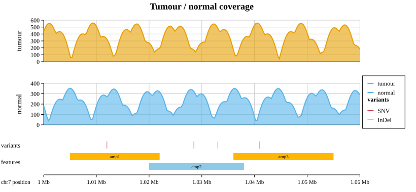
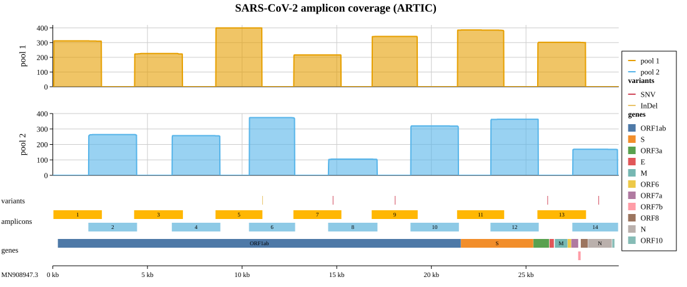
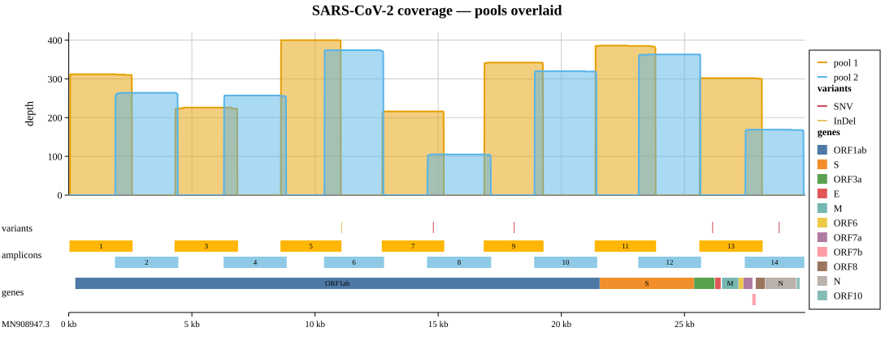

# Coverage Plot

A coverage plot is a genome-browser style figure: several tracks stacked vertically that all share
one genomic x-axis. It is built for sequencing data, where you want to show read depth alongside
variant calls and annotation lanes (amplicons, primers, genes) over the same coordinate.

`CoveragePlot` is a preset that assembles these tracks for you. It is not a bottom level plot type
(like a scatter or a bar); it is a composite figure, in the same family as
[Figure](../reference/figure.md). Under the hood it is built from the general `TrackStack`
primitive (see [The TrackStack primitive](#the-trackstack-primitive) below), so anything the preset
does you can also assemble by hand.

**Type:** `kuva::render::coverage::CoveragePlot`

---

## Basic usage

Add one or more depth samples (each a list of `(position, depth)` pairs), optional typed variants,
and optional feature bands. Set the locus (x range) and render. Each sample becomes a filled area
depth track; variants become a tick lane with a legend; features become a labelled band lane.

```rust,no_run
use kuva::render::coverage::CoveragePlot;
use kuva::backend::svg::SvgBackend;

// (position, depth) pairs per sample
let tumour: Vec<(f64, f64)> = vec![/* ... */];
let normal: Vec<(f64, f64)> = vec![/* ... */];

let scene = CoveragePlot::new()
    .with_title("Tumour / normal coverage")
    .with_locus(1_000_000.0, 1_060_000.0)
    .with_sample("tumour", tumour)
    .with_sample("normal", normal)
    .with_variants("SNV", "#d1495b", vec![1_012_000.0, 1_028_500.0, 1_041_000.0])
    .with_variants("InDel", "#e9c46a", vec![1_033_000.0])
    .with_feature(1_005_000.0, 1_022_000.0, "amp1")
    .with_feature(1_020_000.0, 1_038_000.0, "amp2")
    .with_feature(1_036_000.0, 1_055_000.0, "amp3")
    .with_x_label("chr7 position")
    .render_sized(820.0, 380.0);

let svg = SvgBackend::new().render_scene(&scene);
std::fs::write("coverage.svg", svg).unwrap();
```



The x-axis label sits in the left gutter with the track names, and the genomic axis picks a single
unit (bp, kb, Mb, or Gb) for the whole range so tick labels stay consistent.

---

## Real data (ARTIC SARS-CoV-2)

The figure below is built from the real ARTIC nCoV-2019 example dataset (two per-pool depth files, a
variant call file, and the primer scheme). It shows the pieces working together on genuine data:

* two per-pool depth tracks,
* a variant lane (SNV and InDel), coloured and listed in the legend,
* the 14 real amplicons. Because the ARTIC scheme alternates two primer pools, adjacent amplicons
  overlap and so tile onto two pool-coloured rows (see [Feature tiling](#feature-tiling)),
* a gene / ORF annotation lane, with each gene in its own colour,
* per-track legend sections on the right (samples, variants, genes).



Overlapping features are handled automatically: for example ORF7a and ORF7b overlap by a few bases
in the SARS-CoV-2 genome, so ORF7b is placed on its own row.

---

## Overlaid samples

By default each sample is its own stacked track. Call `.with_overlaid_samples()` to draw every
sample depth in one shared track on a common y-axis instead, for a direct sample-versus-sample
comparison. The samples are distinguished by colour and by the legend.

```rust,no_run
# use kuva::render::coverage::CoveragePlot;
let scene = CoveragePlot::new()
    .with_overlaid_samples()
    .with_sample("pool 1", vec![/* ... */])
    .with_sample("pool 2", vec![/* ... */])
    .render(1100.0);
```



---

## Tracks and options

| Method | Effect |
|--------|--------|
| `.with_sample(name, depth)` | Add a depth track (filled area). One per sample, or overlaid (below). |
| `.with_overlaid_samples()` | Overlay all samples in one shared track instead of stacking. |
| `.with_coverage_threshold(depth)` | Dashed horizontal line at `depth` on every coverage track (e.g. a minimum-depth cutoff). Repeatable. |
| `.with_coverage_threshold_labeled(depth, label)` | Same, with a label at the line. |
| `.with_variants(label, color, positions)` | Add a typed variant group to the variant lane (call once per type). |
| `.with_feature(start, end, label)` | Add one feature band (amplicon / primer). |
| `.with_features(intervals)` | Add several feature bands at once. |
| `.with_region(start, end, label)` | Add a genome region (gene / ORF), coloured per region with a legend. |
| `.with_regions(intervals)` | Add several regions at once. |
| `.with_locus(start, end)` | Pin the x range. Without it, the union of all data is used. |
| `.with_title(text)` | Figure title in a band at the top. |
| `.with_x_label(text)` | X-axis label (drawn in the left gutter). |
| `.with_theme(theme)` | Visual theme. |
| `.with_feature_track_name(name)` / `.with_region_track_name(name)` | Rename the feature / region lanes. |

### Feature tiling

Feature and region lanes use greedy minimum-row packing: each band takes the lowest row where it
does not overlap one already placed. So N mutually overlapping bands need N rows, and no more. This
gives the classic tiled-amplicon layout, where a two-pool primer scheme lands on two rows. Feature
lanes colour rows by pool; region lanes colour each item individually and expose every item in the
legend, so a tiny region whose label does not fit inside its band is still identifiable by colour.

### Legends

Each track contributes its own titled section to a single legend on the right (samples, variants,
genes, and so on), rather than merging everything into one flat list. The legend box is sized to fit
the widest entry across all sections.

---

## The TrackStack primitive

`CoveragePlot` is a thin preset over `kuva::render::track_stack::TrackStack`, a general primitive for
stacking any tracks on a shared x-axis. It is not genomics specific: the same machinery drives, for
example, a financial price / volume figure over a date axis. If you need a layout the preset does
not offer, build a `TrackStack` directly:

* `TrackStack::new().track(t).x_axis().render(width)` assembles a stack. The x-axis is an explicit
  element you place with `.x_axis()`; tracks before it render above, tracks after render below.
* `PlotTrack` wraps any continuous-x `Vec<Plot>` (line, area, scatter, and so on) as a track.
* `IntervalTrack` and `VariantTrack` are the annotation lanes.
* `AxisSpec::genomic(label)` / `AxisSpec::datetime(label)` choose the axis formatting.
* `.underlay(...)` / `.overlay(...)` add layers that span every track (region highlights, cursors).

---

## CLI

The `kuva coverage` subcommand builds the same figure from files. The main input is a depth table
with a position column and one or more sample-depth columns; variants and features come from their
own files.

```bash
kuva coverage depth.tsv --x pos --samples pool1,pool2 \
    --variants variants.tsv \
    --features amplicons.tsv --feature-name amplicons \
    --regions genes.tsv --region-name genes \
    --locus-start 1000000 --locus-end 1040000 \
    --x-label "chr7 position" --title "Amplicon coverage" \
    -o coverage.svg
```

| Flag | Meaning |
|------|---------|
| `--x <col>` | Position column in the depth table (default: 0). |
| `--samples <cols>` | Comma-separated sample depth columns (default: column 1). |
| `--overlay-samples` | Overlay all samples in one shared track. |
| `--min-coverage <depth>` | Dashed threshold line at `depth` on every coverage track (repeatable). |
| `--variants <file>` | Variants file with columns `position,type`. |
| `--features <file>` / `--feature-name <name>` | Feature bands file (`start,end,label`) and lane name. |
| `--regions <file>` / `--region-name <name>` | Region / gene file (`start,end,label`) and lane name. |
| `--locus-start <n>` / `--locus-end <n>` | Pin the genomic window. |
| `--x-label <text>` | X-axis label. |

Standard flags apply too (`--title`, `--width`, `--height`, `--theme`, `-o`, and the PNG / PDF
backends via the output file extension).

The real ARTIC example files live in `examples/data/covar_*.tsv`:

```bash
kuva coverage examples/data/covar_depth.tsv --x pos --samples pool1,pool2 \
    --variants examples/data/covar_variants.tsv \
    --features examples/data/covar_amplicons.tsv --feature-name amplicons \
    --regions examples/data/covar_genes.tsv --region-name genes \
    --x-label "MN908947.3" --title "SARS-CoV-2 amplicon coverage" -o coverage.svg
```

> Note: `--emit-code` is not supported for `coverage` (as with `twin-y`), because it is a composite
> figure rather than a single `render_multiple` call. Use the library API above to reproduce a
> figure in code.

**See also:** [Manhattan Plot](./manhattan.md) for GWAS results on a genomic axis, and
[Figure (Multi-Plot)](../reference/figure.md) for general multi-panel composition.
