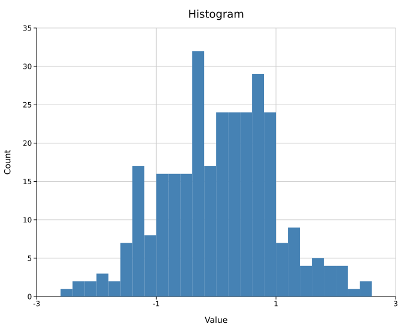
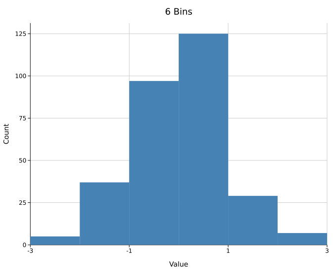
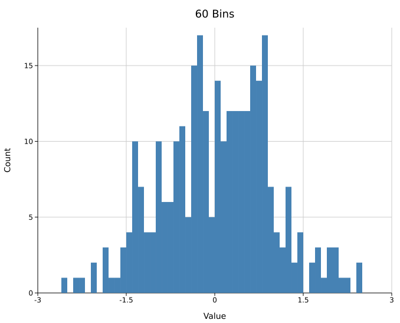
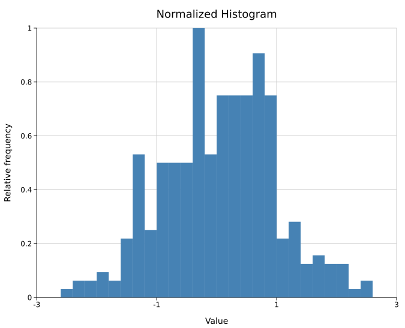
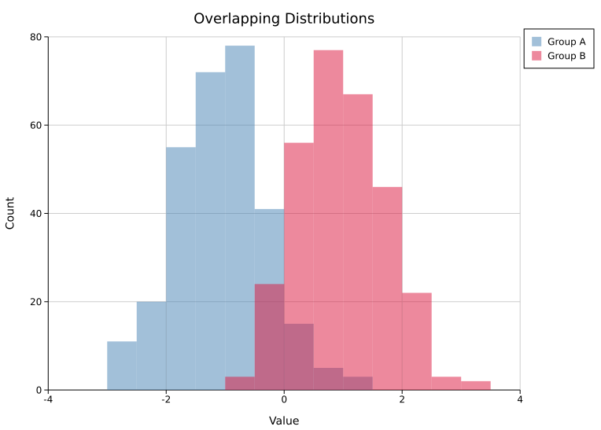
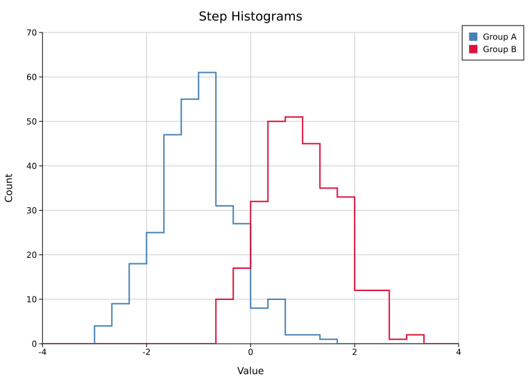
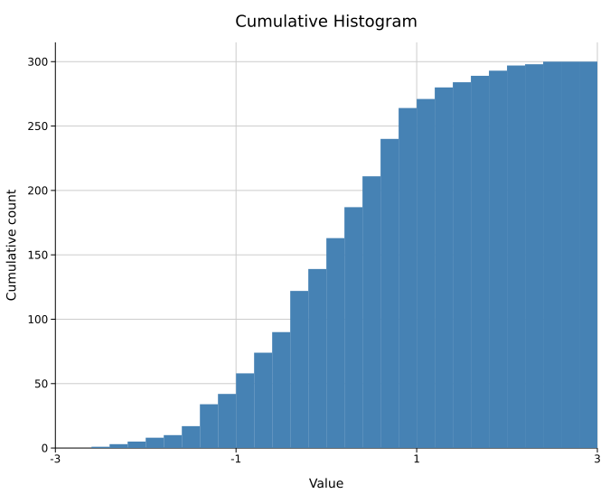
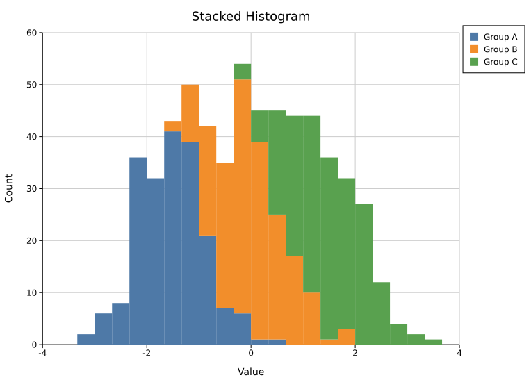

# Histogram

A histogram bins a 1-D dataset into equal-width intervals and renders each bin as a vertical bar. It supports explicit ranges, normalization, and overlapping distributions.

**Import path:** `kuva::plot::Histogram`

---

## Basic usage

`.with_range((min, max))` is **required** — without it `Layout::auto_from_plots` cannot determine the axis extent and will produce an empty chart. Compute the range from your data before building the histogram:

```rust,no_run
use kuva::plot::Histogram;
use kuva::backend::svg::SvgBackend;
use kuva::render::render::render_multiple;
use kuva::render::layout::Layout;
use kuva::render::plots::Plot;

let data: Vec<f64> = vec![/* your samples */];

// Compute range from data first.
let min = data.iter().cloned().fold(f64::INFINITY, f64::min);
let max = data.iter().cloned().fold(f64::NEG_INFINITY, f64::max);

let hist = Histogram::new()
    .with_data(data)
    .with_bins(20)
    .with_range((min, max))   // required for auto_from_plots
    .with_color("steelblue");

let plots = vec![Plot::Histogram(hist)];
let layout = Layout::auto_from_plots(&plots)
    .with_title("Histogram")
    .with_x_label("Value")
    .with_y_label("Count");

let scene = render_multiple(plots, layout);
let svg = SvgBackend.render_scene(&scene);
std::fs::write("histogram.svg", svg).unwrap();
```



---

## Bin count

`.with_bins(n)` sets the number of equal-width bins (default `10`). Fewer bins smooth out noise; more bins reveal finer structure at the cost of per-bin counts. The same range is used in both cases so the x-axis stays comparable.

```rust,no_run
# use kuva::plot::Histogram;
// Coarse — few bins, clear shape
let hist = Histogram::new().with_data(data.clone()).with_bins(5).with_range(range);

// Fine — many bins, more detail
let hist = Histogram::new().with_data(data).with_bins(40).with_range(range);
```

<table>
<tr>
<td></td>
<td></td>
</tr>
</table>

---

## Fixed range

Pass an explicit `(min, max)` to `.with_range()` to fix the bin edges regardless of the data. Values outside the range are silently ignored. This is useful when you want to focus on a sub-range, exclude outliers, or ensure two independent histograms cover the same x-axis scale.

```rust,no_run
# use kuva::plot::Histogram;
let hist = Histogram::new()
    .with_data(data)
    .with_bins(20)
    .with_range((-3.0, 3.0))   // bins fixed to [-3, 3]; outliers ignored
    .with_color("steelblue");
```

---

## Normalized histogram

`.with_normalize()` rescales bar heights so the tallest bar equals `1.0`. This is peak-normalization — useful for comparing the shape of distributions with different sample sizes. The y-axis shows relative frequency, not counts or probability density.

```rust,no_run
use kuva::plot::Histogram;
use kuva::backend::svg::SvgBackend;
use kuva::render::render::render_multiple;
use kuva::render::layout::Layout;
use kuva::render::plots::Plot;

let min = data.iter().cloned().fold(f64::INFINITY, f64::min);
let max = data.iter().cloned().fold(f64::NEG_INFINITY, f64::max);

let hist = Histogram::new()
    .with_data(data)
    .with_bins(20)
    .with_range((min, max))
    .with_color("steelblue")
    .with_normalize();

let plots = vec![Plot::Histogram(hist)];
let layout = Layout::auto_from_plots(&plots)
    .with_title("Normalized Histogram")
    .with_x_label("Value")
    .with_y_label("Relative frequency");
```



---

## Overlapping distributions

Place multiple `Histogram` structs in the same `Vec<Plot>`. Since bars have no built-in opacity setting, use 8-digit hex colors (`#RRGGBBAA`) to make each series semi-transparent so the overlap is visible.

When overlapping, compute a **shared range** from the combined data so both histograms use the same bin edges and x-axis scale:

```rust,no_run
use kuva::plot::Histogram;
use kuva::backend::svg::SvgBackend;
use kuva::render::render::render_multiple;
use kuva::render::layout::Layout;
use kuva::render::plots::Plot;

// Shared range across both groups so x-axes align.
let combined_min = group_a.iter().chain(group_b.iter())
    .cloned().fold(f64::INFINITY, f64::min);
let combined_max = group_a.iter().chain(group_b.iter())
    .cloned().fold(f64::NEG_INFINITY, f64::max);
let range = (combined_min, combined_max);

// #4682b480 = steelblue at ~50% opacity
// #dc143c80 = crimson  at ~50% opacity
let hist_a = Histogram::new()
    .with_data(group_a)
    .with_bins(20)
    .with_range(range)
    .with_color("#4682b480")
    .with_legend("Group A");

let hist_b = Histogram::new()
    .with_data(group_b)
    .with_bins(20)
    .with_range(range)
    .with_color("#dc143c80")
    .with_legend("Group B");

let plots = vec![Plot::Histogram(hist_a), Plot::Histogram(hist_b)];
let layout = Layout::auto_from_plots(&plots)
    .with_title("Overlapping Distributions")
    .with_x_label("Value")
    .with_y_label("Count");

let svg = SvgBackend.render_scene(&render_multiple(plots, layout));
```



The `AA` byte in the hex color controls opacity: `ff` = fully opaque, `80` ≈ 50%, `40` ≈ 25%.

---

## Step (outline) mode

`.with_step(true)` draws each histogram as an outline-only staircase instead of filled bars. This is the cleanest way to overlay several distributions: the outlines never occlude each other, so you can skip the semi-transparent fills.

```rust,no_run
# use kuva::plot::Histogram;
let hist_a = Histogram::new()
    .with_data(group_a).with_bins(24).with_range(range)
    .with_color("#4682b4").with_step(true).with_legend("Group A");
let hist_b = Histogram::new()
    .with_data(group_b).with_bins(24).with_range(range)
    .with_color("#dc143c").with_step(true).with_legend("Group B");
```



---

## Cumulative mode

`.with_cumulative(true)` accumulates counts left-to-right, so each bar includes everything to its left and the final bar equals the total sample count. Combine with `.with_normalize()` for an empirical CDF-style view (peak scaled to 1.0).

```rust,no_run
# use kuva::plot::Histogram;
let hist = Histogram::new()
    .with_data(data).with_bins(30).with_range((-3.0, 3.0))
    .with_color("steelblue").with_cumulative(true);
```



---

## Stacked groups

Add extra series with `.with_group(data, color, label)` and turn on `.with_stacked(true)` to sum them per bin, each group drawn on top of the one below. The primary series (from `.with_data`) is the bottom layer. Without `.with_stacked(true)`, groups draw from a shared baseline (overlaid) instead.

```rust,no_run
# use kuva::plot::Histogram;
let hist = Histogram::new()
    .with_data(group_a).with_bins(24).with_range(range)
    .with_color("#4e79a7").with_stacked(true).with_legend("Group A")
    .with_group(group_b, "#f28e2b", Some("Group B".to_string()))
    .with_group(group_c, "#59a14f", Some("Group C".to_string()));
```



---

## Automatic bin count

`.with_bin_method(BinMethod::…)` picks the bin count from the data, overriding `.with_bins`. Three rules are available:

| Rule | Bin width / count | Best for |
|------|-------------------|----------|
| `BinMethod::Sturges` | `ceil(log2(n)) + 1` bins | Small, roughly Gaussian samples |
| `BinMethod::Scott` | width `3.49·sd·n^(-1/3)` | Smooth data |
| `BinMethod::FreedmanDiaconis` | width `2·IQR·n^(-1/3)` | Data with outliers (robust) |

Scott and Freedman-Diaconis fall back to Sturges on degenerate data (zero variance or IQR).

```rust,no_run
# use kuva::plot::{Histogram, BinMethod};
let hist = Histogram::new()
    .with_data(data).with_range(range)
    .with_bin_method(BinMethod::FreedmanDiaconis);
```

---

## Weighted samples

`.with_weights(weights)` gives each sample a weight, so it contributes its weight to its bin instead of `1`. The vector length must match the data (a mismatch falls back to plain counts).

```rust,no_run
# use kuva::plot::Histogram;
let hist = Histogram::new()
    .with_data(values).with_bins(20).with_range(range)
    .with_weights(weights);   // one weight per sample
```

---

## API reference

| Method | Description |
|--------|-------------|
| `Histogram::new()` | Create a histogram with defaults (10 bins, color `"black"`) |
| `.with_data(iter)` | Set input values; accepts any `Into<f64>` numeric type |
| `.with_bins(n)` | Number of equal-width bins (default `10`) |
| `.with_range((min, max))` | **Required.** Sets bin edges and the layout axis extent |
| `.with_color(s)` | Bar fill color; use 8-digit hex (`#RRGGBBAA`) for alpha transparency |
| `.with_normalize()` | Scale heights so peak bar = 1.0 (relative frequency) |
| `.with_legend(s)` | Attach a legend label to this series |
| `.with_step(bool)` | Draw an outline-only staircase instead of filled bars |
| `.with_cumulative(bool)` | Accumulate counts left-to-right (final bar = total) |
| `.with_bin_method(m)` | Auto bin count (`Sturges` / `Scott` / `FreedmanDiaconis`); overrides `.with_bins` |
| `.with_weights(v)` | Per-sample weights (length must match the data) |
| `.with_group(data, color, label)` | Add another series, stacked or overlaid |
| `.with_stacked(bool)` | Stack `groups` on the primary series instead of overlaying |

**See also:** [Density Plot](./density.md) for a smoothed alternative, [Ridgeline Plot](./ridgeline.md) for comparing many groups, [Q-Q Plot](./qq.md) for checking normality.

---

## CLI

Frequency histogram from one or more numeric columns.

**Input:** one or more numeric columns per row.

| Flag | Default | Description |
|---|---|---|
| `--value-col <COL>` | `0` | Value column (single-column mode) |
| `--y <COL>[,<COL>…]` | — | Comma-separated columns; overlays one histogram per column over a shared x-range (overrides `--value-col`) |
| `--color <CSS>` | `steelblue` | Bar fill color (single-column mode) |
| `--bins <N>` | `10` | Number of bins (ignored when `--bin-method` is set) |
| `--bin-method <RULE>` | — | Auto bin count: `sturges`, `scott`, or `fd`; overrides `--bins` |
| `--normalize` | off | Normalize to probability density (area = 1) |
| `--step` | off | Outline-only staircases instead of filled bars |
| `--cumulative` | off | Accumulate counts left-to-right |
| `--stacked` | off | Stack the `--y` columns instead of overlaying them |
| `--weight-col <COL>` | — | Per-sample weight column (single-column mode) |
| `--legend` | off | Show a legend entry for each series |

```bash
kuva histogram histogram.tsv --value-col value --bins 30

kuva histogram histogram.tsv --bins 20 --normalize \
    --title "Expression distribution" --y-label "Density"

# automatic bin count (Freedman-Diaconis) and a cumulative view
kuva histogram histogram.tsv --value-col value --bin-method fd --cumulative

# overlay two columns as clean step outlines
kuva histogram data.tsv --y col_a,col_b --step --legend

# stack three columns into one histogram
kuva histogram data.tsv --y col_a,col_b,col_c --stacked --legend
```

---

*See also: [Shared flags](../cli/index.md#shared-flags) — output, appearance, axes, log scale.*
