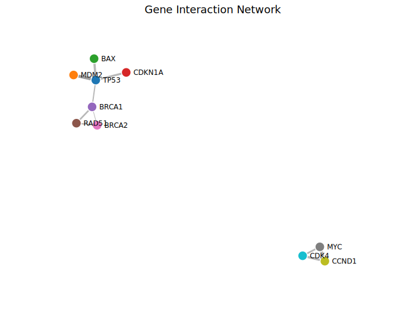
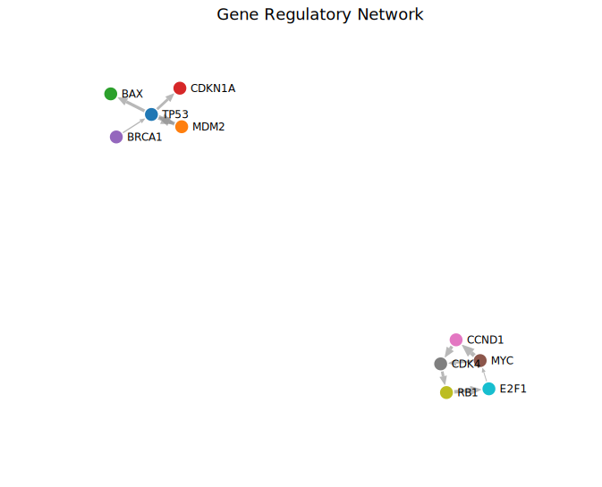
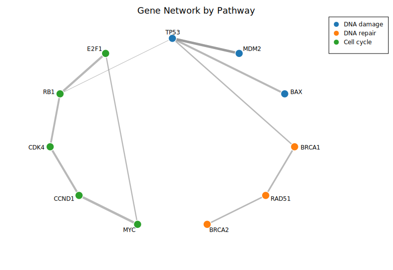

# Network Plot

A network (graph) plot visualises nodes connected by edges, laid out with a force-directed (Fruchterman-Reingold) or circular algorithm. It is well suited for showing gene regulatory networks, protein-protein interactions, social graphs, or any pairwise relationship data. Edge weight can control stroke width, edges can be directed (arrowheads) or undirected, and nodes can be coloured by group.

**Import path:** `kuva::plot::NetworkPlot`

---

## Basic usage

Supply edges with `.with_edge(source, target, weight)`. Nodes are auto-created from edge endpoints. The force-directed layout places connected nodes closer together.

```rust,no_run
use kuva::plot::NetworkPlot;
use kuva::backend::svg::SvgBackend;
use kuva::render::render::render_multiple;
use kuva::render::layout::Layout;
use kuva::render::plots::Plot;

let net = NetworkPlot::new()
    .with_edge("TP53", "MDM2", 0.95)
    .with_edge("TP53", "BAX", 0.82)
    .with_edge("TP53", "CDKN1A", 0.78)
    .with_edge("MDM2", "TP53", 0.88)
    .with_edge("BRCA1", "TP53", 0.65)
    .with_edge("BRCA1", "RAD51", 0.72)
    .with_edge("RAD51", "BRCA2", 0.68)
    .with_edge("BRCA2", "BRCA1", 0.55)
    .with_edge("MYC", "CCND1", 0.91)
    .with_edge("MYC", "CDK4", 0.74)
    .with_edge("CCND1", "CDK4", 0.83)
    .with_labels();

let plots = vec![Plot::Network(net)];
let layout = Layout::auto_from_plots(&plots)
    .with_title("Gene Interaction Network");

let svg = SvgBackend.render_scene(&render_multiple(plots, layout));
std::fs::write("network.svg", svg).unwrap();
```



Edge thickness is proportional to weight. The Fruchterman-Reingold layout clusters tightly connected nodes (the TP53-MDM2 hub) while spacing out loosely connected components.

---

## Directed edges

Use `.with_directed()` to draw arrowheads indicating edge direction — useful for regulatory networks, citation graphs, or state machines.

```rust,no_run
# use kuva::plot::NetworkPlot;
# use kuva::render::plots::Plot;
let net = NetworkPlot::new()
    .with_edge("TP53", "MDM2", 0.95)
    .with_edge("MDM2", "TP53", 0.88)
    .with_edge("CDK4", "RB1", 0.79)
    .with_edge("RB1", "E2F1", 0.86)
    .with_edge("E2F1", "MYC", 0.62)
    .with_directed()
    .with_labels();
```



Arrowheads point from source to target. Reciprocal edges (TP53 <-> MDM2) are drawn as two separate arrows. Edge lines stop at the node boundary so arrowheads are clearly visible.

---

## Grouped nodes with legend

Assign nodes to groups with `.with_node_group()` for automatic colour-coding. Use `.with_legend()` to display a colour key. Combine with `.with_layout(NetworkLayout::Circle)` for a circular arrangement.

```rust,no_run
# use kuva::plot::network::{NetworkPlot, NetworkLayout};
# use kuva::render::plots::Plot;
let net = NetworkPlot::new()
    .with_edge("TP53", "MDM2", 0.95)
    .with_edge("BRCA1", "RAD51", 0.72)
    .with_edge("MYC", "CCND1", 0.91)
    .with_edge("TP53", "RB1", 0.45)
    .with_node_group("TP53", "DNA damage")
    .with_node_group("MDM2", "DNA damage")
    .with_node_group("BRCA1", "DNA repair")
    .with_node_group("RAD51", "DNA repair")
    .with_node_group("MYC", "Cell cycle")
    .with_node_group("CCND1", "Cell cycle")
    .with_node_group("RB1", "Cell cycle")
    .with_layout(NetworkLayout::Circle)
    .with_labels()
    .with_legend("Pathway");
```



Nodes are coloured by group using the `category10` palette. The legend maps each colour to its group label. The circle layout spaces nodes evenly around the perimeter.

---

## Input formats

### Edge list (builder API)

The primary input: call `.with_edge(source, target, weight)` or `.with_edges(iter)`. Nodes are auto-created from edge endpoints.

### Adjacency matrix

Use `.with_matrix(matrix, labels)` to build from an N×N matrix. Non-zero entries become edges; the value is the weight. For undirected graphs (default), only the upper triangle is read.

```rust,no_run
# use kuva::plot::NetworkPlot;
let matrix = vec![
    vec![0.0, 1.0, 1.0],
    vec![1.0, 0.0, 1.0],
    vec![1.0, 1.0, 0.0],
];
let net = NetworkPlot::new()
    .with_matrix(matrix, ["A", "B", "C"]);
```

---

## Layout algorithms

| Layout | Method | Description |
|--------|--------|-------------|
| Force-directed | `NetworkLayout::ForceDirected` (default) | Fruchterman-Reingold: connected nodes attract, all nodes repel. Best for most graphs. Uses Barnes-Hut approximation for n > 256. |
| Kamada-Kawai | `NetworkLayout::KamadaKawai` | Stress-based: Euclidean distances reflect graph-theoretic distances. Better for small-medium graphs. |
| Circle | `NetworkLayout::Circle` | Nodes evenly spaced on a circle. Deterministic and clean for small/medium graphs. |

User-supplied positions can pin individual nodes with `.with_node_position(label, x, y)` in normalised `[0, 1]` space; unpinned nodes are placed by the layout algorithm.

---

## Self-loops

Self-loops (`source == target`) are rendered as a small arc pointing outward from the graph centre. They work with both directed (arrowhead) and undirected modes.

---

## API reference

| Method | Description |
|--------|-------------|
| `NetworkPlot::new()` | Create a network plot with defaults |
| `.with_edge(src, tgt, w)` | Add an edge (auto-creates nodes) |
| `.with_edge_color(src, tgt, w, color)` | Add an edge with explicit colour |
| `.with_edge_label(src, tgt, w, label)` | Add an edge with a midpoint label |
| `.with_edge_styled(src, tgt, w, color, label)` | Add an edge with both colour and label |
| `.with_edges(iter)` | Bulk-add `(src, tgt, weight)` edges |
| `.with_matrix(m, labels)` | Build from N×N adjacency matrix |
| `.with_node(label)` | Declare a node explicitly |
| `.with_node_color(label, c)` | Set a node's colour |
| `.with_node_size(label, s)` | Set a node's radius |
| `.with_node_group(label, g)` | Assign a node to a group |
| `.with_node_shape(label, shape)` | Set marker shape (`Circle`, `Square`, `Triangle`, `Diamond`) |
| `.with_node_position(label, x, y)` | Pin a node at `(x, y)` in `[0, 1]` space |
| `.with_directed()` | Draw arrowheads on edges |
| `.with_layout(alg)` | Set layout algorithm (`ForceDirected`, `KamadaKawai`, or `Circle`) |
| `.with_node_radius(px)` | Base node radius in pixels (default `8.0`) |
| `.with_edge_opacity(f)` | Edge opacity `0.0`-`1.0` (default `0.6`) |
| `.with_labels()` | Show node labels |
| `.with_repel_labels()` | Push overlapping labels apart |
| `.with_legend(s)` | Show a per-group colour legend |
| `.with_label_size(px)` | Override label font size |
