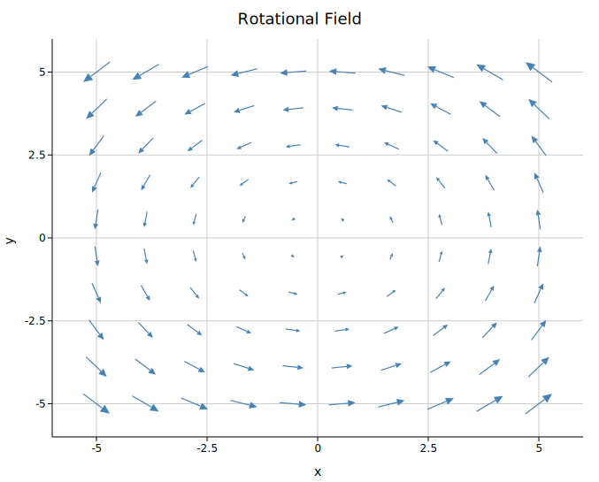

# Quiver Plot

A quiver plot visualises a 2-D vector field as a grid of arrows. Each arrow has a **tail** at data coordinates `(x, y)` and a **vector** `(u, v)` that controls its direction and length. Quiver plots are the canonical way to show fluid flow, force fields, gradients, wind / current patterns, and any other data where each location has an associated direction and magnitude.

**Import path:** `kuva::plot::quiver::QuiverPlot`

---

## Basic usage

The most common case is sampling a vector-field closure `f: (x, y) → (u, v)` on a regular grid. Use `QuiverPlot::from_function`:

```rust,no_run
use kuva::plot::QuiverPlot;
use kuva::backend::svg::SvgBackend;
use kuva::render::render::render_multiple;
use kuva::render::layout::Layout;
use kuva::render::plots::Plot;

// Rotational field: (u, v) = (-y, x) on a 10×10 grid.
let plot = QuiverPlot::from_function(
    (-5.0, 5.0, 10),
    (-5.0, 5.0, 10),
    |x, y| (-y * 0.3, x * 0.3),
)
    .with_color("steelblue");

let plots = vec![Plot::Quiver(plot)];
let layout = Layout::auto_from_plots(&plots)
    .with_title("Rotational Field")
    .with_x_label("x")
    .with_y_label("y");

let svg = SvgBackend.render_scene(&render_multiple(plots, layout));
std::fs::write("quiver.svg", svg).unwrap();
```



For irregular data (not on a grid), add arrows one at a time with `.with_arrow(x, y, u, v)`, or pass an iterator of `(x, y, u, v)` tuples to `.with_arrows()`.

---

## Scaling

By default the scale multiplier is **auto-computed** so the longest arrow is roughly one grid cell long — approximated as `span / √n` for `n` arrows on a span of `R`. This prevents arrows from overlapping each other in dense fields, so zero-config quiver plots look sensible no matter what units `(u, v)` are in.

Two overrides are available when you need explicit control:

- `.with_scale(s)` — pin the multiplier. Arrow length in data coords is `(u, v) * s`.
- `.with_auto_scale(fraction)` — keep auto-scaling on, but change the target fraction of the nearest-neighbor distance (default `0.9`). Values near `1.0` pack arrows tip-to-tail; smaller values leave more breathing room.

---

## Pivot

By default, `(x, y)` is the arrow's **tail** — the arrow points away from that point. For data where `(x, y)` is the location at which a field is being sampled, `QuiverPivot::Middle` centers each arrow on its data point, which reads more naturally as "what the field is doing *at* this location":

```rust,no_run
use kuva::plot::{QuiverPlot, QuiverPivot};
# use kuva::render::plots::Plot;

let plot = QuiverPlot::new()
    .with_arrow(0.0, 0.0, 1.0, 0.0)
    .with_pivot(QuiverPivot::Middle);
```

`QuiverPivot::Tip` makes `(x, y)` the arrow's tip (the arrow comes *into* the point).

---

## Coloring by magnitude

Passing a `ColorMap` colors each arrow by its magnitude `sqrt(u² + v²)` and automatically renders a colorbar.

```rust,no_run
use kuva::plot::quiver::QuiverPlot;
use kuva::plot::ColorMap;
# use kuva::render::plots::Plot;

let plot = QuiverPlot::new()
    .with_arrow(0.0, 0.0, 1.0, 0.0)
    .with_arrow(1.0, 0.0, 0.5, 0.5)
    .with_color_map(ColorMap::Viridis)
    .with_color_legend_label("Speed");
```

Priority: per-arrow color (via `.with_colored_arrow()`) > colormap > single color.

---

## Arrow styling

- `.with_shaft_width(px)` — stroke width of the shaft (default `1.2`).
- `.with_head_ratio(r)` — head length as a fraction of the shaft (default `0.28`). Heads are always proportional by default, so every arrow looks like an arrow regardless of magnitude.
- `.with_head(length_px, half_width_px)` — pin the head to fixed pixel dimensions. Useful when you want identical glyphs across a mixed-magnitude field.

Proportional heads are clamped to `[4, 14]` pixels so tiny arrows still show a visible head and long arrows don't grow gigantic ones. The shaft is automatically shortened so it terminates at the base of the head, not overlapping it.

---

## CLI flags reference

| Flag | Default | Description |
|---|---|---|
| `--x-col <COL>` | `0` | Tail X column |
| `--y-col <COL>` | `1` | Tail Y column |
| `--u-col <COL>` | `2` | Vector x-component column |
| `--v-col <COL>` | `3` | Vector y-component column |
| `--color <CSS>` | `steelblue` | Arrow color (overridden by `--colormap`) |
| `--arrow-scale <F>` | — | Pin `(u, v)` multiplier (disables auto-scaling) |
| `--auto-scale <F>` | `0.9` | Fraction of the nearest-neighbor distance for the longest arrow |
| `--shaft-width <PX>` | `1.2` | Shaft stroke width |
| `--head-length <PX>` | *proportional* | Pin head length to fixed pixels (default is 28% of shaft, clamped to 4–14 px) |
| `--head-width <PX>` | *proportional* | Pin head half-width to fixed pixels |
| `--colormap <NAME>` | — | Color arrows by magnitude (see CLI reference for names) |
| `--colorbar-label <TXT>` | — | Colorbar title |
| `--pivot <MODE>` | `tail` | Where `(x, y)` sits on each arrow: `tail`, `middle`, or `tip` |
| `--tight-bounds` | off | Derive axis bounds from arrow tails only |
| `--legend <TXT>` | — | Legend entry label |

See [kuva quiver](../cli/quiver.md) for CLI usage examples.
