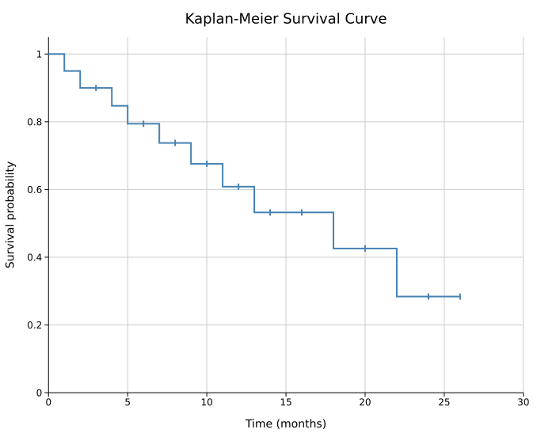
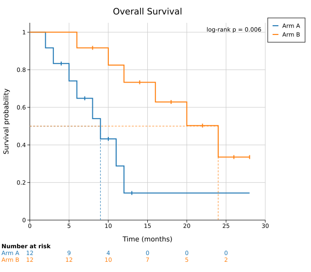

# Kaplan-Meier Survival Curve

A Kaplan-Meier (KM) survival plot displays the probability that subjects remain event-free over time. Each subject contributes one observation: the time to event (e.g., death, relapse) or the time at last follow-up for censored subjects who did not experience the event.

KM curves are the standard tool in clinical trials, epidemiology, and any study that measures time-to-event outcomes. Multiple groups are compared side-by-side, and a log-rank p-value is typically annotated.

**Import path:** `kuva::plot::survival::{SurvivalPlot, KMGroup}`

---

## Basic usage

Pass `times` (float) and `events` (bool) vectors to `.with_group()`. `true` means the event occurred; `false` means the observation was censored. Censoring tick marks appear on the curve by default.

```rust,no_run
use kuva::plot::survival::SurvivalPlot;
use kuva::backend::svg::SvgBackend;
use kuva::render::render::render_multiple;
use kuva::render::layout::Layout;
use kuva::render::plots::Plot;

let times  = vec![2.0, 4.0, 6.0, 8.0, 10.0, 12.0, 14.0, 16.0, 18.0, 20.0];
let events = vec![true, true, false, true, false, true, false, true, false, true];

let plot = SurvivalPlot::new()
    .with_group("Treatment", times, events);

let plots = vec![Plot::Survival(plot)];
let layout = Layout::auto_from_plots(&plots)
    .with_title("Overall Survival")
    .with_x_label("Time (months)")
    .with_y_label("Survival probability");

let svg = SvgBackend.render_scene(&render_multiple(plots, layout));
std::fs::write("survival.svg", svg).unwrap();
```



Tick marks on the curve indicate censored observations — subjects who were still event-free at their last follow-up. Suppress them with `.with_censoring(false)`.

---

## Multi-group comparison

Add one `.with_group()` per arm. Attach `.with_legend()` to label the curves. Annotate a p-value with `.with_pvalue_text()` for a pre-computed value, or `.with_logrank_pvalue(true)` to compute the log-rank test from the raw data (see [Clinical annotations](#clinical-annotations)).

```rust,no_run
use kuva::plot::survival::SurvivalPlot;
use kuva::backend::svg::SvgBackend;
use kuva::render::render::render_multiple;
use kuva::render::layout::Layout;
use kuva::render::plots::Plot;

let plot = SurvivalPlot::new()
    .with_group(
        "Arm A",
        vec![3.0, 6.0, 9.0, 12.0, 15.0, 18.0, 21.0, 24.0],
        vec![true, true, false, true, true, false, true, false],
    )
    .with_group(
        "Arm B",
        vec![2.0, 4.0, 5.0, 8.0, 11.0, 14.0, 17.0, 22.0],
        vec![true, true, true, false, true, true, false, true],
    )
    .with_pvalue_text("log-rank p = 0.031")
    .with_legend("Treatment");

let plots = vec![Plot::Survival(plot)];
let layout = Layout::auto_from_plots(&plots)
    .with_title("Progression-Free Survival")
    .with_x_label("Time (months)")
    .with_y_label("Survival probability");

let svg = SvgBackend.render_scene(&render_multiple(plots, layout));
```


---

## Clinical annotations

Three options turn a survival plot into a publication-style clinical figure:

- `.with_risk_table(true)` draws a **number-at-risk table** below the plot, one row per group, with counts at each x-axis tick (survminer `risk.table = TRUE`). Space for the table is reserved automatically.
- `.with_median_lines(true)` draws **median-survival reference lines**: a dashed horizontal at S = 0.5 out to each curve's median time, then a dashed vertical down to the axis (survminer `surv.median.line`). Groups whose survival never reaches 0.5 get no line.
- `.with_logrank_pvalue(true)` computes the **log-rank test** p-value from the raw data and annotates it (e.g. `log-rank p = 0.023`), overriding any `.with_pvalue_text()`. Two groups use the exact Mantel-Haenszel statistic; three or more use the `Σ (O−E)²/E` approximation.

```rust,no_run
# use kuva::plot::survival::SurvivalPlot;
let plot = SurvivalPlot::new()
    .with_group("Arm A", arm_a_times, arm_a_events)
    .with_group("Arm B", arm_b_times, arm_b_events)
    .with_legend("Treatment")
    .with_risk_table(true)
    .with_median_lines(true)
    .with_logrank_pvalue(true);
```



### Reading the number-at-risk table

Each cell is the **number of subjects still under follow-up at that time**: everyone whose observed time (event or censoring) is greater than or equal to the tick. It is a plain integer count, and it only ever decreases from left to right as subjects have the event or are censored. The columns line up with the time ticks on the x-axis.

In the figure above (12 subjects per arm):

- At time 0 both arms start at the full cohort (12 and 12).
- Arm A drops to 4 by time 10: only the 4 subjects whose follow-up reached month 10 are still being observed; the other 8 have already had the event or been censored.
- Arm B falls more slowly (12 at time 5, still 10 at time 10) because its events happen later.

**The table count is not the survival probability times N.** The curve shows the estimated survival *probability* S(t) (a value between 0 and 1); the table shows the *denominator* behind that estimate (how many people the curve is actually based on at each time). The two match only when there is no censoring. With censoring they diverge: in the figure, Arm A's curve sits near S(10) ≈ 0.43, which would suggest about 0.43 × 12 ≈ 5 survivors, yet only **4** are still at risk, and the difference is exactly the subjects censored before month 10.

Read the two together: when the risk-table count gets small (single digits, or 0), the curve at that time is based on very few subjects and its later steps should be treated as uncertain, which is why clinical figures print the table directly under the curve.

---

## Confidence intervals

`.with_ci(true)` overlays Greenwood 95% CI bands around each curve. Control opacity with `.with_ci_alpha()`.

```rust,no_run
use kuva::plot::survival::SurvivalPlot;
use kuva::render::plots::Plot;
# use kuva::render::layout::Layout;
# use kuva::render::render::render_multiple;

let plot = SurvivalPlot::new()
    .with_group(
        "Biomarker high",
        vec![4.0, 8.0, 12.0, 16.0, 20.0, 24.0, 28.0, 32.0, 36.0],
        vec![true, true, false, true, false, true, false, false, true],
    )
    .with_group(
        "Biomarker low",
        vec![2.0, 3.0, 6.0, 9.0, 11.0, 14.0, 17.0, 20.0, 23.0],
        vec![true, true, true, true, false, true, true, false, true],
    )
    .with_ci(true)
    .with_ci_alpha(0.15)
    .with_pvalue_text("p < 0.001")
    .with_legend("Biomarker status");

let plots = vec![Plot::Survival(plot)];
```


---

## Custom colors

Use `.with_colored_group()` to set a per-group color, or `.with_group_colors()` to set all colors at once.

```rust,no_run
use kuva::plot::survival::SurvivalPlot;
use kuva::render::plots::Plot;
# use kuva::render::layout::Layout;
# use kuva::render::render::render_multiple;

let plot = SurvivalPlot::new()
    .with_colored_group(
        "Responders",
        vec![8.0, 12.0, 18.0, 24.0, 30.0, 36.0],
        vec![true, false, true, false, false, true],
        "#2ca02c",
    )
    .with_colored_group(
        "Non-responders",
        vec![3.0, 5.0, 7.0, 10.0, 13.0, 16.0],
        vec![true, true, true, false, true, true],
        "#d62728",
    )
    .with_ci(true)
    .with_legend("Response");

let plots = vec![Plot::Survival(plot)];
```

---

## SurvivalPlot API reference

### `SurvivalPlot` builders

| Method | Default | Description |
|--------|---------|-------------|
| `SurvivalPlot::new()` | — | Create a survival plot with default settings |
| `.with_group(label, times, events)` | — | Add a group; `events`: `true` = event occurred, `false` = censored |
| `.with_colored_group(label, times, events, color)` | — | Add a group with a per-group color |
| `.with_color(css)` | `"steelblue"` | Fallback color for a single unlabeled group |
| `.with_group_colors(iter)` | — | Per-group colors (by group order) |
| `.with_line_width(px)` | `2.0` | Curve stroke width |
| `.with_ci(bool)` | `false` | Overlay Greenwood 95% CI bands |
| `.with_ci_alpha(f)` | `0.2` | CI band opacity |
| `.with_censoring(bool)` | `true` | Show censoring tick marks on curves |
| `.with_censoring_size(px)` | `4.0` | Half-height of censoring ticks |
| `.with_pvalue_text(s)` | — | P-value or annotation rendered in the upper-right corner |
| `.with_risk_table(bool)` | `false` | Number-at-risk table below the plot |
| `.with_median_lines(bool)` | `false` | Median-survival reference lines |
| `.with_logrank_pvalue(bool)` | `false` | Compute and annotate the log-rank p-value |
| `.with_legend(label)` | — | Legend title (one entry per group) |

**See also:** [Forest Plot](./forest.md) for point-estimate meta-analysis, [ROC Curve](./roc.md) for another step-function statistical curve.

---

## CLI

Kaplan-Meier survival curve — estimates the survival function from time-to-event data with right-censoring.

**Input:** one row per subject with time, event indicator (1 = event occurred, 0 = censored), and optional group columns.

| Flag | Default | Description |
|---|---|---|
| `--time-col <COL>` | `0` | Follow-up time column |
| `--event-col <COL>` | `1` | Event indicator column (1 = event, 0 = censored) |
| `--group-col <COL>` | — | Group column; one curve per unique value |
| `--no-ci` | off | Hide Greenwood 95% confidence interval bands |
| `--no-censoring` | off | Hide censoring tick marks |
| `--line-width <PX>` | `2.0` | Stroke width of survival curves |
| `--legend <LABEL>` | — | Add a legend |
| `--risk-table` | off | Draw a number-at-risk table below the plot |
| `--median-lines` | off | Draw median-survival reference lines |
| `--logrank` | off | Compute and annotate the log-rank p-value |

```bash
kuva survival data.tsv --time-col time --event-col event

kuva survival data.tsv --time-col time --event-col event \
    --group-col treatment --legend "Group" \
    --title "Kaplan-Meier Survival by Treatment"
```

---

*See also: [Shared flags](../cli/index.md#shared-flags) — output, appearance, axes.*
