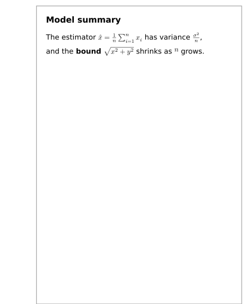
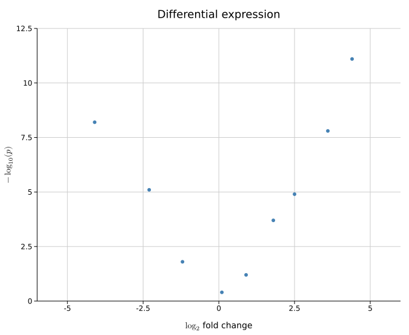
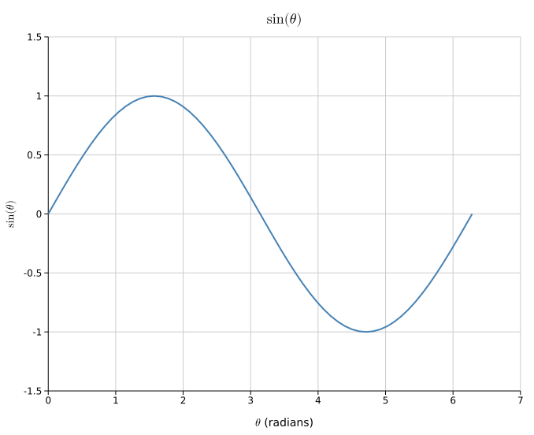
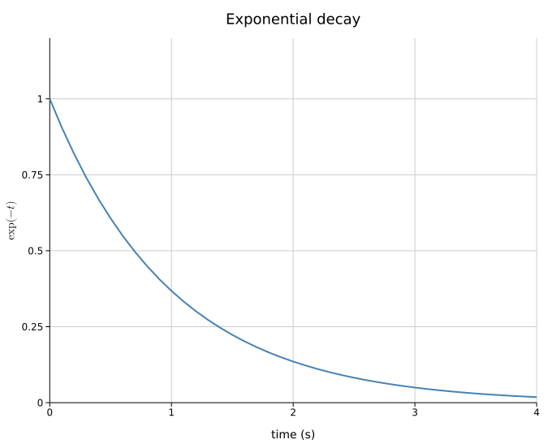
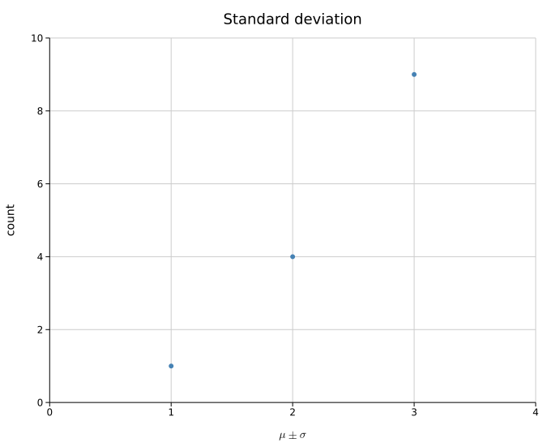
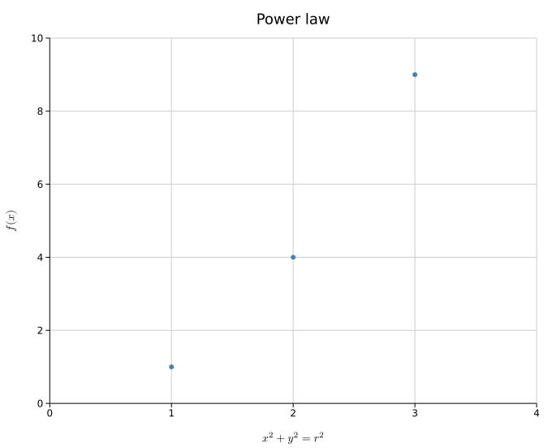
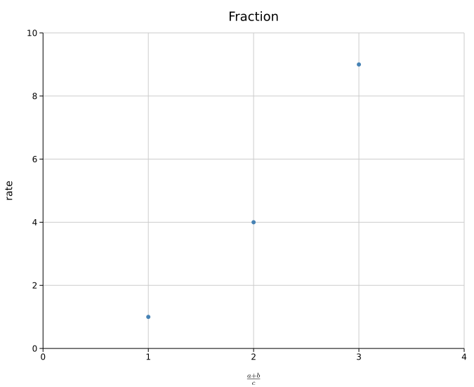
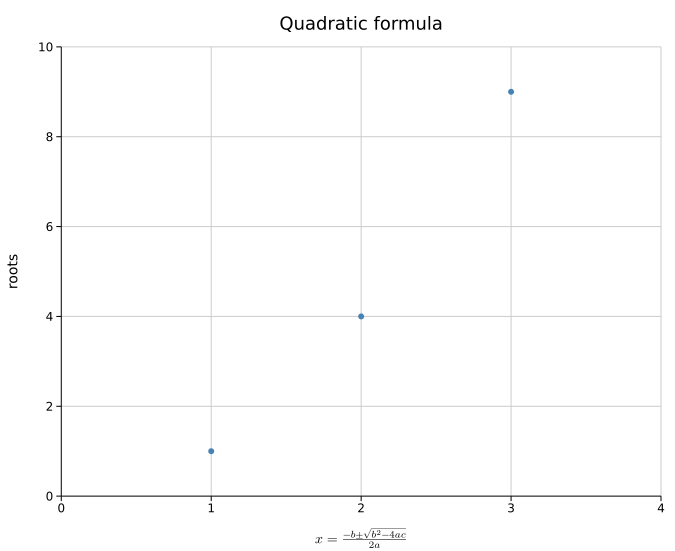
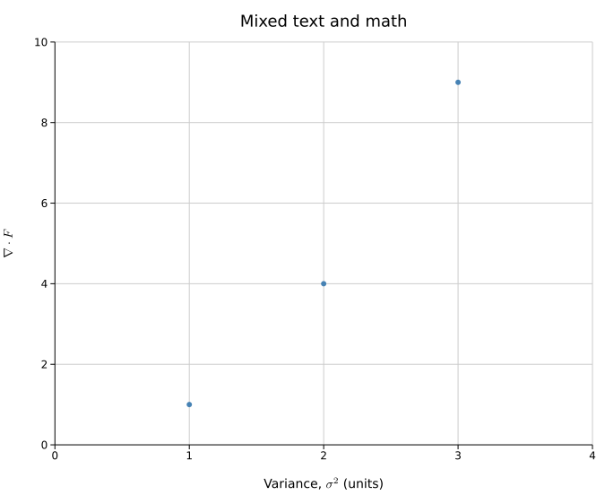
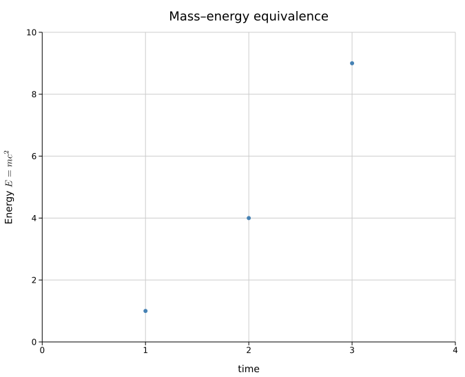

# Math in Labels

Any label — plot title, axis labels, `TextPlot` markdown bodies — may embed math
inside `$...$` using LaTeX-ish syntax. There are two rendering tiers, chosen by
how you build kuva:

- **Lookup tier** (always available, zero dependencies): math is lowered to
  inline **Unicode** text at render time, in every backend including the
  terminal. The tables below show its output.
- **Typst tier** (feature `pdf`, included in `full` and the release CLI
  binaries): the whole label is typeset by the [Typst](https://typst.app)
  compiler — linked as a library, no external binary — and embedded in
  SVG/PNG/PDF output as real 2-D math: stacked fractions, radicals with
  vinculum, large operators, math italic. The terminal always uses the lookup
  tier (a character grid can't hold typeset math).

The same `$...$` source drives both tiers, so code never changes — only the
fidelity of the output does.

```rust
Layout::new((0.0, 3.0), (0.0, 10.0))
    .with_x_label("$\\log_2$ fold change")
    .with_y_label("$-\\log_{10}(p)$")
    .with_title("Differential expression ($\\alpha = 0.05$)");
```

A literal dollar sign is written `\$`. A `$` without a closing partner is left
untouched as plain text.

## Quick examples (lookup tier)

| Input | Output |
|-------|--------|
| `$\sigma^2$` | σ² |
| `$x_i$` | xᵢ |
| `$\mu \pm \sigma$` | μ ± σ |
| `$a \leq b \cdot c$` | a ≤ b · c |
| `$\frac{a+b}{c}$` | (a+b)/c |
| `$\sqrt{x^2+y^2}$` | √(x²+y²) |
| `$\sum_{i=1}^{n} x_i$` | ∑ᵢ₌₁ⁿ xᵢ |
| `$-\log_{10}(p)$` | -log₁₀(p) |
| `$\sin(\theta)$` | sin(θ) |
| `$\exp(-t)$` | exp(-t) |
| `$f \circ g$` | f ∘ g |

## Supported syntax

### Greek letters

Both cases: `\alpha`…`\omega` (lowercase) and `\Gamma`, `\Delta`, `\Theta`,
`\Lambda`, `\Xi`, `\Pi`, `\Sigma`, `\Phi`, `\Psi`, `\Omega` (uppercase).
Variants: `\varepsilon` → ε, `\varphi` → φ.

### Operators, relations, arrows

`\pm` ±, `\mp` ∓, `\times` ×, `\cdot` ·, `\div` ÷, `\circ` ∘,
`\leq` ≤, `\geq` ≥, `\neq` ≠, `\approx` ≈, `\equiv` ≡, `\sim` ∼,
`\propto` ∝, `\ll` ≪, `\gg` ≫,
`\in` ∈, `\notin` ∉, `\subset` ⊂, `\cup` ∪, `\cap` ∩,
`\infty` ∞, `\partial` ∂, `\nabla` ∇, `\degree` °, `\angle` ∠,
`\forall` ∀, `\exists` ∃, `\ldots` …, `\cdots` ⋯,
`\sum` ∑, `\prod` ∏, `\int` ∫,
`\to`/`\rightarrow` →, `\leftarrow` ←, `\Rightarrow` ⇒, `\Leftarrow` ⇐,
`\leftrightarrow` ↔.

### Operator names

Standard LaTeX function names pass through as plain text — their arguments and
subscripts lower normally:

| Command | Output | Typical use |
|---------|--------|-------------|
| `\log` | log | `$\log_{10} x$` → log₁₀ x |
| `\ln` | ln | `$\ln(n)$` → ln(n) |
| `\exp` | exp | `$\exp(-t)$` → exp(-t) |
| `\sin` | sin | `$\sin(\theta)$` → sin(θ) |
| `\cos` | cos | `$\cos(\phi)$` → cos(φ) |
| `\tan` | tan | `$\tan(\alpha)$` → tan(α) |
| `\arcsin` | arcsin | `$\arcsin(x)$` → arcsin(x) |
| `\arccos` | arccos | |
| `\arctan` | arctan | |
| `\min` | min | `$\min(a,b)$` → min(a,b) |
| `\max` | max | |
| `\lim` | lim | `$\lim_{x \to 0}$` → lim_(x → 0) |
| `\limsup` | lim sup | |
| `\liminf` | lim inf | |
| `\sup` | sup | |
| `\inf` | inf | (infimum, not infinity — use `\infty` for ∞) |
| `\arg` | arg | |
| `\det` | det | |
| `\dim` | dim | |
| `\ker` | ker | |
| `\gcd` | gcd | |
| `\lcm` | lcm | |
| `\Pr` | Pr | |
| `\deg` | deg | |

### Superscripts and subscripts

`^` and `_` take a single character or a `{...}` group. These are
**all-or-nothing**: every character in the group must have a Unicode
super/subscript form, otherwise the whole group falls back to a clean
`x^(…)` or `x_(…)` — never a half-substituted mix.

```
x^2       → x²         (digit, maps cleanly)
x^{2n}    → x²ⁿ        (both have superscript forms)
x^{2q}    → x^(2q)     (q has no superscript — clean fallback)
x_i       → xᵢ
x_{i+1}   → xᵢ₊₁
```

Braceless command operands work too: `x^\alpha` → x^(α), `x_\beta` → x_(β).

### Fractions and radicals

`\frac{a}{b}` → `a/b`; multi-term parts are parenthesised: `\frac{a+b}{c}` →
`(a+b)/c`. Rendering is always **inline** — the output is plain text that flows
anywhere a label can go, including rotated y-axis titles and terminal grids.

`\sqrt{x}` → `√x`, `\sqrt{x+y}` → `√(x+y)`, `\sqrt[3]{x}` → `³√x`.

## Typst tier

With the `pdf` feature, `$...$` labels upgrade automatically from the inline
Unicode above to real typeset math. A compile failure never breaks a plot:
the label falls back to the lookup tier and a one-time warning names the
expression and Typst's hint.

**Typst math is not LaTeX.** The `$...$` body is LaTeX-flavoured for
familiarity, but in Typst a multi-letter run is a single identifier: `mc` is
not `m × c`, so `$E = mc^2$` fails to compile (and falls back to the lookup
tier). Write the factors separated:

```text
$E = m c^2$      ✓
$E = mc^2$       ✗  (lookup tier + a one-time warning)
```

### Math in TextPlot bodies

`$...$` inside a markdown `TextPlot` body is spliced into the wrapped
paragraph as a typeset fragment: kuva's own word-wrap treats each fragment as
one unbreakable word, the surrounding words stay real (selectable) text, and
a line holding a tall fragment (stacked fraction, radical) grows its leading
so neighbouring lines never collide.



## Plot examples

Generated by `cargo run --features full --example math` — built with `full`,
so these show the **typst tier**. Without `pdf` the same code produces the
lookup tier's inline-Unicode forms instead:

### Scientific axes

`$\log_2$ fold change` / `$-\log_{10}(p)$` — the standard RNA-seq and GWAS
axis pair:



### Trigonometric labels

`$\sin(\theta)$` in the title and y-axis label:



### Exponential decay

`$\exp(-t)$` on the y-axis:



### Greek letters and symbols

`$\mu \pm \sigma$` on the x-axis:



### Superscripts

`$x^2 + y^2 = r^2$` as the x-axis label:



### Fractions

`$\frac{a+b}{c}$` → `(a+b)/c`:



### Square root

`$\sqrt{x^2+y^2}$` → `√(x²+y²)`:


### Summation with limits

`$\sum_{i=1}^{n} x_i$` → `∑ᵢ₌₁ⁿ xᵢ`:


### Quadratic formula

`$x = \frac{-b \pm \sqrt{b^2 - 4 a c}}{2 a}$` — the lookup tier lowers this to `x = (-b ± √(b² - 4 a c))/(2 a)`:



### Mixed text and math



### Rotated y-axis title

`Energy $E = m c^2$` — math works in rotated labels too:



## CLI

Math works in any label flag — no extra flags needed:

```bash
kuva scatter data.tsv \
    --x log2fc --y neg_log10_pvalue \
    --x-label '$\log_2$ fold change' \
    --y-label '$-\log_{10}(p)$' \
    --title 'Differential expression ($\alpha = 0.05$)' \
    -o volcano.svg
```

The same labels render in the terminal backend with `--terminal` — the lowered
Unicode lands directly on the character grid.

### Shell quoting

`$` and `\` are special characters in most shells. **Single quotes** are the
simplest way to pass math labels literally — the shell treats everything between
`'...'` as plain text:

```bash
--x-label '$\log_2$ fold change'   # single quotes: $ and \ are literal
```

If you need to interpolate a shell variable into a label that also contains
math, mix quote styles:

```bash
SAMPLE="$(basename "$file" .tsv)"
--title '$\sigma^2$ for '"$SAMPLE"
#        ^^^^^^^^^^^^^^^^ literal  ^^^^^^^^^ variable expands
```

Or use double quotes and escape both `$` and `\`:

```bash
--title "\$\\sigma^2\$ for $SAMPLE"
#        \$ → $,  \\ → \,  $SAMPLE → expands
```

On **Windows** (cmd.exe / PowerShell), `$` and `\` have no special meaning in
double-quoted strings, so no escaping is needed:

```powershell
kuva scatter data.tsv --x-label "$\log_2$ fold change"
```
